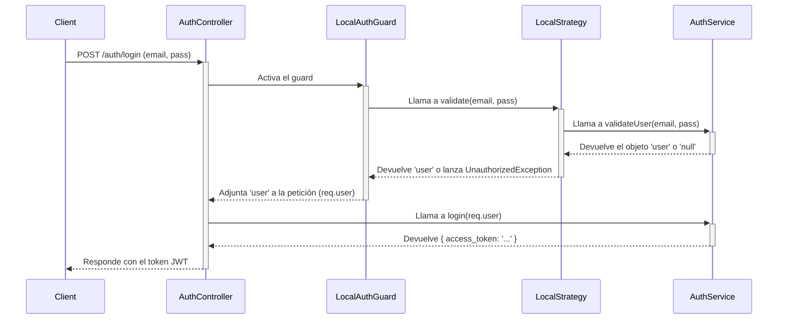
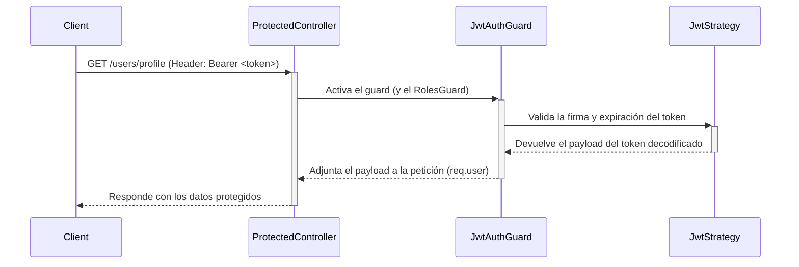

# Manual Técnico: Módulo de Autenticación

Este documento explica el funcionamiento del módulo de autenticación (`auth`) en el backend de Mozzarella Cloud. El sistema utiliza **Passport.js** con una estrategia dual: `local` para el login y `jwt` para autorizar las solicitudes posteriores.

## Flujo de Autenticación (Login)

El proceso de login se activa cuando un cliente envía una petición `POST` a `/auth/login` con su email y contraseña.

## Flujos de Activación y Creación de Tenants

Esta sección detalla la lógica detrás de la creación de nuevos tenants y la activación de cuentas de usuario. Es fundamental entender que en Mozzarella Cloud existen **dos flujos distintos** para crear un nuevo negocio (tenant), y ambos culminan en la activación de una licencia de prueba.

### 1. Flujo de Registro Público (Autoservicio)

Un usuario se registra por su cuenta a través de un formulario público. Este proceso se divide en dos fases:

1.  **Registro (`register` en `auth.service.ts`)**:
    -   Se crea un `Tenant` con estado `inactive`.
    -   Se crea una `Location` por defecto ("Sucursal Principal").
    -   Se crea un `User` con el rol `admin`, se le asigna el nuevo tenant y la sucursal, y su estado se establece en `pending_verification`.
    -   Se genera un token JWT de activación y se envía un correo de bienvenida al usuario.

2.  **Verificación de Correo (`verifyEmail` en `auth.service.ts`)**:
    -   Cuando el usuario hace clic en el enlace del correo, el backend valida el token.
    -   El estado del `User` se cambia a `active`.
    -   El estado del `Tenant` se cambia a `trial` y se le asigna el plan de prueba.
    -   **Se genera automáticamente una licencia de prueba por 30 días** para el tenant.
    -   El usuario ya puede iniciar sesión.

### 2. Flujo de Creación por Super Admin

El Super Administrador crea un nuevo tenant y su usuario administrador desde el panel.

1.  **Creación (`create` en `super-admin.service.ts`)**:
    -   Se crea un `Tenant` con estado `inactive`.
    -   Se crea una `Location` por defecto ("Sucursal Principal").
    -   Se crea un `User` con el rol `admin`, se le asigna el tenant y la sucursal, y su estado se establece en `pending_verification`.
    -   Se genera un token JWT de configuración y se envía un correo de invitación al usuario.

2.  **Configuración de Cuenta (`setupAccount` en `auth.service.ts`)**:
    -   Cuando el usuario hace clic en el enlace, se le pide que establezca una contraseña.
    -   El backend valida el token y la nueva contraseña.
    -   El estado del `User` se cambia a `active`.
    -   El estado del `Tenant` se cambia a `trial` y se le asigna el plan de prueba.
    -   **Se genera automáticamente una licencia de prueba por 30 días** para el tenant.
    -   Se emite un token de sesión y el usuario inicia sesión automáticamente.

> **Nota Importante**: Ambos flujos utilizan tokens JWT "stateless" (sin estado) para los correos de activación/configuración. Esto elimina errores de "token inválido" que ocurrían con sistemas anteriores y hace el proceso mucho más robusto.

### Payload del Token

Una vez que el `AuthService` valida al usuario, crea un "payload" (carga útil) con información esencial y lo firma para generar el `access_token`. Este payload es lo que se recupera en las rutas protegidas.

El payload contiene:
*   `sub`: El ID del usuario (userId).
*   `email`: El email del usuario.
*   `role`: El rol del usuario (ej. 'admin').
*   `tenantId`: El ID del tenant al que pertenece el usuario.
*   `locationId`: El ID de la sucursal a la que está asignado el usuario. Este campo puede ser `null` para roles como el `Admin` del tenant, que tienen acceso a todas las sucursales.

Este payload es validado por la `JwtStrategy` en cada petición a una ruta protegida.

## Flujo de Autorización (Rutas Protegidas)

Una vez que el cliente tiene el `access_token`, debe incluirlo en el encabezado `Authorization` de cada petición a una ruta protegida.

## Responsabilidad de los Archivos

*   **`auth.controller.ts`**:
    *   Define el endpoint `/auth/login`.
    *   Usa el `@UseGuards(LocalAuthGuard)` para iniciar el proceso de autenticación.

*   **`auth.service.ts`**:
    *   `validateUser(email, pass)`: Busca un usuario por email y compara la contraseña recibida con el hash guardado en la base de datos usando `bcrypt.compare`.
    *   `login(user)`: Si la validación es exitosa, crea un payload con información del usuario (ID, email, rol, tenantId, locationId) y lo firma usando `jwtService` para generar el `access_token`.
    *   **Nota**: El envío de correos (verificación, reseteo de contraseña, etc.) utiliza un `SettingsService` que obtiene la configuración SMTP dinámicamente desde la base de datos o, en su defecto, desde las variables de entorno, haciendo el sistema más flexible.

*   **`strategies/local.strategy.ts`**:
    *   Implementa la lógica de Passport para la estrategia 'local'.
    *   Recibe el `email` y `password` del cuerpo de la petición y utiliza `authService.validateUser` para verificar las credenciales.

*   **`strategies/jwt.strategy.ts`**:
    *   Implementa la lógica para la estrategia 'jwt'.
    *   Extrae el token del encabezado `Authorization: Bearer ...`.
    *   Verifica automáticamente la firma y la fecha de expiración del token usando el `secret` configurado. Si es válido, el método `validate` se ejecuta.
    *   El payload decodificado del token se devuelve y se adjunta a la petición para su uso en los controladores.

*   **`guards/local-auth.guard.ts` y `jwt-auth.guard.ts`**:
    *   Son "puentes" que conectan las rutas de NestJS con las estrategias de Passport. Al decorar una ruta con `@UseGuards(JwtAuthGuard)`, se asegura que solo las peticiones con un JWT válido puedan acceder.

*   **`auth.module.ts`**:
    *   Ensambla todo el módulo.
    *   Importa `UsersModule` para poder usar `UsersService`.
    *   Configura `JwtModule` con el secreto y el tiempo de expiración del token.
    *   Registra las estrategias (`LocalStrategy`, `JwtStrategy`) como proveedores para que puedan ser inyectadas en el sistema.

*   **`constants.ts`**:
    *   Contiene el secreto del JWT. **Importante**: Para producción, este valor NUNCA debe estar en el código. Debe cargarse desde variables de entorno.