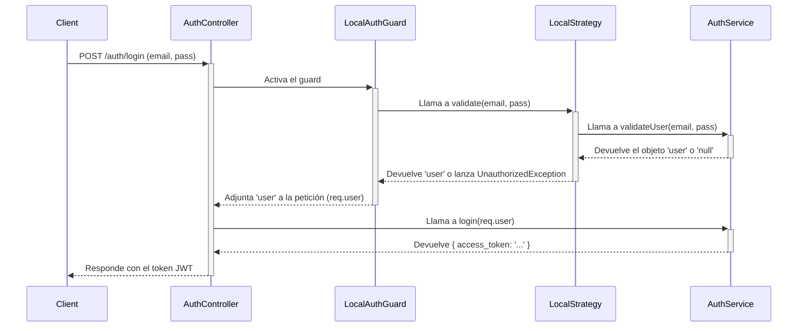
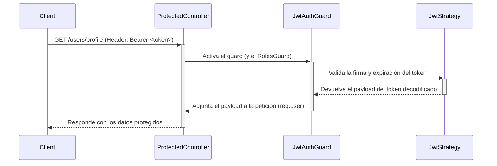

# Manual Técnico: Módulo de Autenticación

Este documento explica el funcionamiento del módulo de autenticación (`auth`) en el backend de Mozzarella Cloud. El sistema utiliza **Passport.js** con una estrategia dual: `local` para el login y `jwt` para autorizar las solicitudes posteriores.

## Flujo de Autenticación (Login)

El proceso de login se activa cuando un cliente envía una petición `POST` a `/auth/login` con su email y contraseña.

## Flujos de Activación y Creación de Tenants

Esta sección detalla la lógica detrás de la creación de nuevos tenants y la activación de cuentas de usuario, un proceso crítico que ha sido refactorizado para ser más robusto y fiable.

### 1. Cambio a Tokens "Stateless" (JWT)

Anteriormente, el sistema utilizaba tokens temporales que se guardaban en la base de datos para acciones como la activación de una cuenta o el reseteo de contraseña. Este enfoque (stateful) presentaba un problema: si el sistema generaba un nuevo token y lo guardaba, pero fallaba al enviar el correo electrónico, el usuario quedaba con un enlace antiguo que ya no era válido, resultando en un error de "token inválido".

**Solución Implementada:**

El sistema ahora utiliza **tokens "stateless" (sin estado)**, implementados con JSON Web Tokens (JWT).

-   **Generación**: Cuando se necesita una acción (ej. activar cuenta), se genera un JWT que contiene la información necesaria (como el `userId` y el tipo de acción) y una fecha de expiración.
-   **Envío**: Este token se envía al usuario por correo.
-   **Validación**: El backend solo necesita verificar la firma y la validez del JWT para autorizar la acción, sin necesidad de consultar o modificar un token en la base de datos.

Este cambio, implementado principalmente en `backend/src/auth/auth.service.ts`, elimina la desincronización entre la base de datos y el correo enviado, haciendo el proceso mucho más robusto.

### 2. Doble Flujo de Creación de Tenants

Es fundamental entender que en Mozzarella Cloud existen **dos flujos distintos** para crear un nuevo negocio (tenant).

1.  **Flujo de Registro Público**: Un usuario se registra por su cuenta a través de un formulario público.
    -   **Archivo responsable**: `backend/src/auth/auth.service.ts` (método `register`).

2.  **Flujo de Creación desde Super Admin**: El Super Administrador da de alta un nuevo tenant y su primer usuario administrador desde su panel de control.
    -   **Archivo responsable**: `backend/src/super-admin/super-admin.service.ts` (método `create`).

> **Nota Importante para Desarrolladores**: Cualquier modificación en la lógica de creación de un tenant (como añadir valores por defecto, cambiar estados iniciales, etc.) **debe ser implementada en ambos archivos** (`auth.service.ts` y `super-admin.service.ts`) para mantener la consistencia en todo el sistema.

### 3. Creación de Sucursal por Defecto

**Problema Anterior**: Al crear un nuevo tenant, no se creaba ninguna sucursal por defecto. Esto causaba que el administrador del nuevo tenant viera una página en blanco al iniciar sesión, ya que el dashboard requiere que exista al menos una sucursal para funcionar.

**Solución Implementada**:

Ahora, durante la creación de un tenant (en ambos flujos mencionados anteriormente), el sistema realiza dos acciones adicionales:
1.  Crea automáticamente una sucursal por defecto llamada **"Sucursal Principal"**.
2.  Asigna el primer usuario administrador a esta nueva sucursal.

Esto garantiza que cada nuevo negocio tenga una configuración inicial funcional, eliminando la página en blanco y mejorando la experiencia de incorporación del cliente.

### Payload del Token

Una vez que el `AuthService` valida al usuario, crea un "payload" (carga útil) con información esencial y lo firma para generar el `access_token`. Este payload es lo que se recupera en las rutas protegidas.

El payload contiene:
*   `sub`: El ID del usuario (userId).
*   `email`: El email del usuario.
*   `role`: El rol del usuario (ej. 'admin').
*   `tenantId`: El ID del tenant al que pertenece el usuario.
*   `locationId`: El ID de la sucursal a la que está asignado el usuario. Este campo puede ser `null` para roles como el `Admin` del tenant, que tienen acceso a todas las sucursales.

Este payload es validado por la `JwtStrategy` en cada petición a una ruta protegida.

## Flujo de Autorización (Rutas Protegidas)

Una vez que el cliente tiene el `access_token`, debe incluirlo en el encabezado `Authorization` de cada petición a una ruta protegida.

## Responsabilidad de los Archivos

*   **`auth.controller.ts`**:
    *   Define el endpoint `/auth/login`.
    *   Usa el `@UseGuards(LocalAuthGuard)` para iniciar el proceso de autenticación.

*   **`auth.service.ts`**:
    *   `validateUser(email, pass)`: Busca un usuario por email y compara la contraseña recibida con el hash guardado en la base de datos usando `bcrypt.compare`.
    *   `login(user)`: Si la validación es exitosa, crea un payload con información del usuario (ID, email, rol, tenantId, locationId) y lo firma usando `jwtService` para generar el `access_token`.
    *   **Nota**: El envío de correos (verificación, reseteo de contraseña, etc.) utiliza un `SettingsService` que obtiene la configuración SMTP dinámicamente desde la base de datos o, en su defecto, desde las variables de entorno, haciendo el sistema más flexible.

*   **`strategies/local.strategy.ts`**:
    *   Implementa la lógica de Passport para la estrategia 'local'.
    *   Recibe el `email` y `password` del cuerpo de la petición y utiliza `authService.validateUser` para verificar las credenciales.

*   **`strategies/jwt.strategy.ts`**:
    *   Implementa la lógica para la estrategia 'jwt'.
    *   Extrae el token del encabezado `Authorization: Bearer ...`.
    *   Verifica automáticamente la firma y la fecha de expiración del token usando el `secret` configurado. Si es válido, el método `validate` se ejecuta.
    *   El payload decodificado del token se devuelve y se adjunta a la petición para su uso en los controladores.

*   **`guards/local-auth.guard.ts` y `jwt-auth.guard.ts`**:
    *   Son "puentes" que conectan las rutas de NestJS con las estrategias de Passport. Al decorar una ruta con `@UseGuards(JwtAuthGuard)`, se asegura que solo las peticiones con un JWT válido puedan acceder.

*   **`auth.module.ts`**:
    *   Ensambla todo el módulo.
    *   Importa `UsersModule` para poder usar `UsersService`.
    *   Configura `JwtModule` con el secreto y el tiempo de expiración del token.
    *   Registra las estrategias (`LocalStrategy`, `JwtStrategy`) como proveedores para que puedan ser inyectadas en el sistema.

*   **`constants.ts`**:
    *   Contiene el secreto del JWT. **Importante**: Para producción, este valor NUNCA debe estar en el código. Debe cargarse desde variables de entorno.