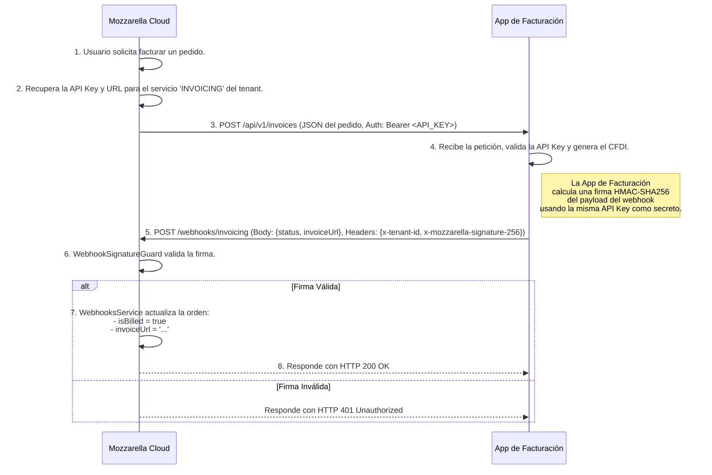

# Guía de Arquitectura: Integraciones Externas

Este documento detalla la arquitectura implementada en Mozzarella Cloud para comunicarse de forma segura y escalable con servicios externos, como la nueva aplicación de facturación.

## Visión General

Se tomó la decisión estratégica de desacoplar la lógica de facturación de Mozzarella Cloud. En lugar de manejar directamente los Certificados de Sello Digital (CSD) y las contraseñas de los clientes, el sistema ahora se integra con una aplicación de facturación externa y dedicada.

Esta arquitectura se basa en dos componentes clave:
1.  **Gestión de API Keys**: Para que Mozzarella Cloud se autentique de forma segura al enviar datos a servicios externos.
2.  **Receptor de Webhooks**: Para que los servicios externos puedan notificar a Mozzarella Cloud sobre eventos (ej. una factura timbrada), permitiendo una comunicación bidireccional.

---

## Componentes Clave

### 1. Módulo de Gestión de API Keys (`ApiKeysModule`)

Este módulo permite al Super Administrador gestionar las credenciales necesarias para que cada tenant se conecte con servicios externos.

-   **Entidad `ApiKey`**: Almacena la información de cada integración, incluyendo:
    -   `tenantId`: A qué negocio pertenece la clave.
    -   `serviceIdentifier`: Un enum que identifica el servicio (ej. `INVOICING`).
    -   `apiUrl`: El endpoint al que Mozzarella Cloud debe llamar.
    -   `key`: La clave secreta del servicio externo, **almacenada de forma encriptada** en la base de datos.
-   **Servicio `EncryptionService`**: Un servicio central que utiliza `aes-256-gcm` para cifrar y descifrar las claves API antes de guardarlas o usarlas. La clave de cifrado maestra se gestiona a través de la variable de entorno `ENCRYPTION_KEY`.

### 2. Módulo de Webhooks (`WebhooksModule`)

Este módulo proporciona endpoints seguros para recibir notificaciones de servicios externos.

-   **Controlador `WebhooksController`**: Define los endpoints, como `/webhooks/invoicing`.
-   **Guardia `WebhookSignatureGuard`**: Es el componente de seguridad más crítico. Protege los endpoints de webhooks y realiza las siguientes validaciones en cada petición entrante:
    1.  Verifica la existencia de las cabeceras `x-tenant-id` y `x-mozzarella-signature-256`.
    2.  Usa el `tenantId` para buscar la clave secreta compartida (la misma API Key) en la base de datos.
    3.  Calcula una firma HMAC-SHA256 del cuerpo (`body`) de la petición usando la clave secreta.
    4.  Compara de forma segura (`timingSafeEqual`) su firma calculada con la firma recibida en la cabecera `x-mozzarella-signature-256`.
    5.  Si las firmas no coinciden, la petición es rechazada con un error `401 Unauthorized`, protegiendo el sistema contra peticiones no autorizadas o manipuladas.

---

## Flujo de Ejemplo: Facturar un Pedido

